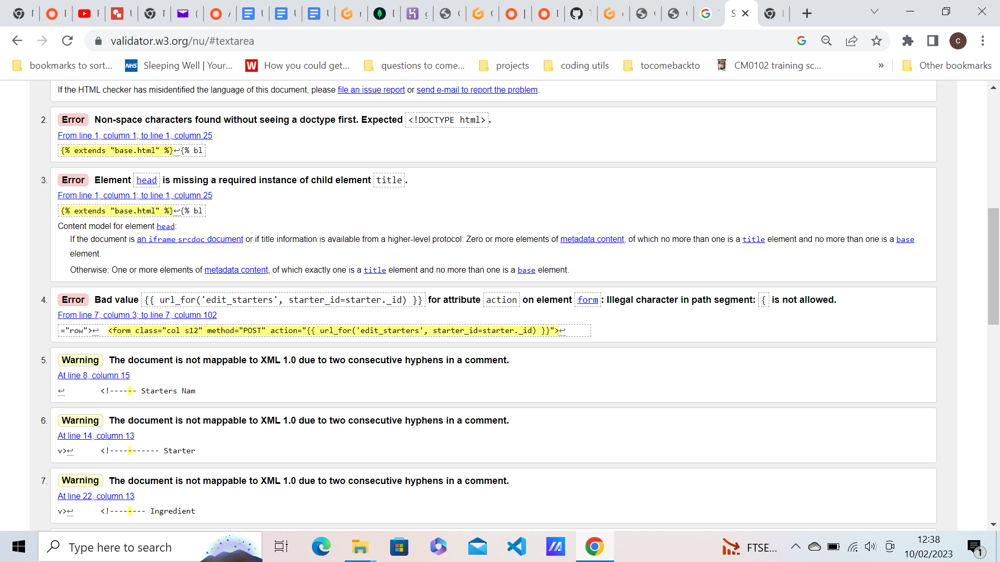

1 align="center">GlutenFree Recipes</h1>

[View live project](https://glutenfree-recipes.herokuapp.com/)

This project, is a Gluten-Free recipe database where you can can enter your recipes on the home page, and they will show up on the appropriate pages, i.e Starters , Mains etc.
There is also the option to edit or delete these recipes.
I chose this project because a family member has celiac disease and has to maintian a gluten-free diet. 
This is my 2nd attempt at this project because my first project failed, and I had to start the project again due to the amount of errors I was getting which I never had previously

screen shots here

## User Experience

The target audience of this site is for people with celiac disease or who need to maintain a gluten free diet.

As a user I would:

1. I want to see the recipes broken into various categories  so I can decide what I would like to prepare and when.

2. I want to view a list of gluten-free recipes that is healthy for me to eat.

3. I want to know the prepareations for each meal so I can allocate my time accordingly.

4. I want to be able to save my recipes so I can have quick access to all my favorites.

5. I want to view a complete list of ingredients so I  know what’s needed to prepare the dish.

6. I want to be able to remove ingredients from the list so I don’t double-up on items I may already
have.

7. I want to be able to add in notes to each dish so I can add my own thoughts, experiences or
things I want to remember about cooking the dish.

8. I want to be able to have my own personel profile where only I can add or delete items.

You must register and log into the site before you can view, delete, or add items.

## Wireframes

## Design

## Typography

## Technologies Used

## Frameworks, Libraries & Programs Used

## Testing
 -  The W3C Markup Validator and W3C CSS Validator Services were used to validate every page of the front ednd of the project to ensure there were no syntax errors in the project.

  -   [W3C Markup Validator](https://jigsaw.w3.org/css-validator/#validate_by_input)

Here is the Registration Page:
<h2 align="center"></h2>

Here is the Login Page:
<h2 align="center"></h2>

Here is the profile page:
<h2 align="center"></h2>

Here Is the home page:
<h2 align="center"></h2>

Here are the tests from the starters:

Starters:

Edit Starters:

Add Starters:

## Testing User Stories from User Experience Section

## Bugs
I had trouble getting psql to work , I kept having the error:

 psql: error: connection to server on socket "/var/run/postgresql/.s.PGSQL.5432" failed: No such file or directory Is the server running locally and accepting connections on that socket?

Everything I tried did not work so I have decided to use MongoDB instead.
I also had an error which was:

'Collection' object is not callable. If you meant to call the 'update' method on a 'Collection' object it is failing because no such method exists 

This was related to the line mongo.db.starter.update({"_id": ObjectId(starter_id)}, edited_starter) in my edit_starters function in app.py, so I had downgrade pymongo from  4.3.3 to 3.12.3.

## Deployment

## Acknowledgements

